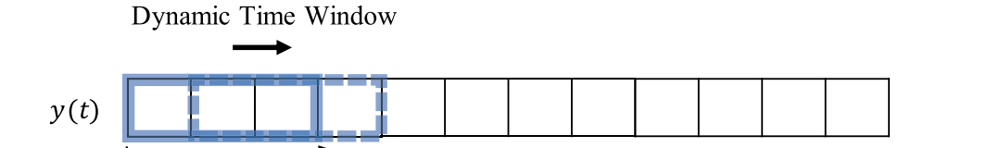
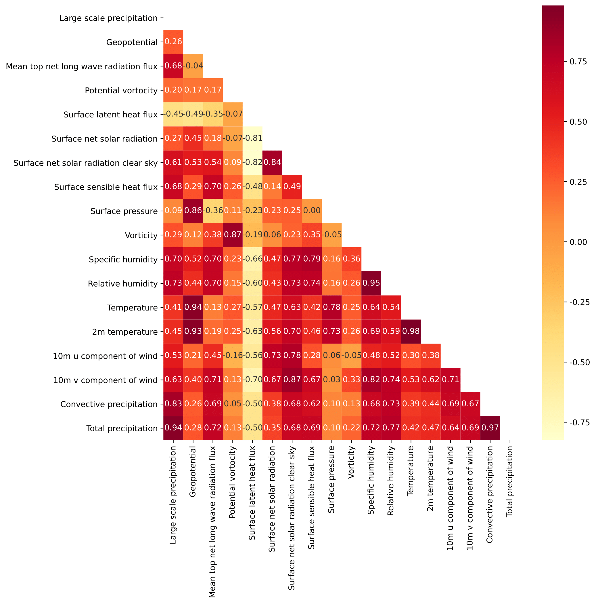
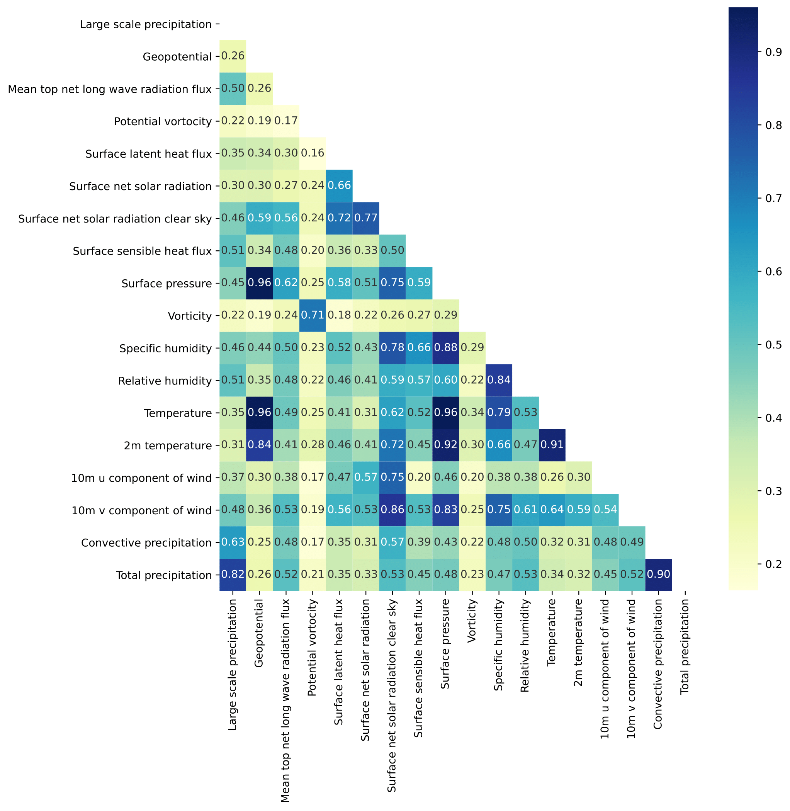

# Atmospheric Science Study Notes💦

我曾任职于[三维时空股份有限公司](http://xn--ehq269cgqo6ge.xn--fiqs8s/)从事大气学科与机器学习交叉学科的项目。我会以此博客记录工作中遇到的一些问题与目前自己的学习记录。

## 晴雨预报与暴雨预报

晴雨预报与降雨预报是第一阶段的工作，主要是负责短期预报形式。以天为单位，目标是判断隔天有无降雨以及是否有特大暴雨的情况，即：

**假设一个城市 $C$ 某天 $n$ 的降水总量(Total Precipitation)为 $T_p$ ,那么则有**

$$
\left\{
             \begin{array}{lr}
             \mbox{$C$城市第$n$天将没有降雨;} & T_p \leq 0.1 mm \\
             \mbox{$C$城市第$n$天将会有降雨;} & T_p > 0.1 mm \\
             \mbox{$C$城市第$n$天将有大暴雨.} & T_p > 32 mm  
             \end{array}
\right.
$$

在第一阶段的工作中，使用的是ERA5的数据集，已经完成了初步的数据清洗和模型调整。

我尝试了多种模型的结果，目前的预测模式是前七天迭代预测第八天的降雨情况，使用的是TS评分，分别使用了单特征、前五个特征和前八个特征。这本质上是两个分类问题。所以使用的模型均为分类模型。

特大暴雨结果如下：
| Machine Learning | Number of features |               |
|------------------|--------------------|---------------|
|                  | Five characteristics | Eight characteristics |
| Logistic | 0.02 | 0.02 |
| SVC | 0 | 0 |
| BLS | 0 | 0 |
| DT | **0.08** | **0.07** |
| RF | 0.04 | 0.06 |
| GBDT | 0.04 | 0.04 |
| XGBoost | 0.03 | 0.03 |
| Etr | 0 | 0 |
| Lgb | 0.04 | 0.04 |

晴雨预报结果如下:
| Machine Learning      | Number of features |       |       | Deep Learning/VMD-ML  |     |
|-----------------------|:------------------:|:-----:|:-----:|:----------------------:|:---:|
|                       | One                | Five  | Eight |                        | One |
| Logistic              | 0.671              | 0.703 | 0.694 | RNN                    | 0.651 |
| SVC                   | 0.672              | 0.693 | 0.699 | LSTM                   | **0.668** |
| BLS                   | 0.667              | 0.672 | 0.669 | GRU                    | 0.664 |
| DT                    | 0.624              | 0.672 | 0.682 | LSTNet                 | 0.653 |
| RF                    | 0.702              | 0.714 | 0.711 |                        |      |
| GBDT                  | **0.719**          | **0.731** | **0.729** | VMD-GBDT  | 0.718 |
| XGBoost               | 0.709              | 0.722 | 0.714 |                        |      |
| Etr                   | 0.710              | 0.717 | 0.712 |
| Lgb                   | 0.714              | 0.722 | 0.724 |                        |      |

单站点调参的结果如下：
|                                          | *Machine Learning* |      **The target variable**       |
| :--------------------------------------: | :----------------: | :--------------------------------: |
|                 **Five**                 |        GBDT        |      0.77($Iterative$)      |         $None$         |
|                                          |         DT         |          $None$           |           0.141            |
|                **Eight**                 |        GBDT        |      0.75($Iterative$)      |         $None$         |
|                                          |         DT         |          $None$           |          0.129           |

***具体了解请阅读晴雨预报与暴雨短时预报的[报告](Rainfall_Report20230427.pdf)。***

--- 

## 月季度的降水预报

第二部分的工作我将会负责月季度降水量的工作，使用的仍然是ERA5的福建地区的数据，数据精度为0.25 $km$ \* 0.25 $km$ 。目的是预测次月的月降水总量，是一个回归的问题。最后清洗的表格为19\*20=380条序列，就是每个月一个格点会有一条序列，那么每个月就会有380条序列数据。

### 数据集整合

在第一部分的工作中，由于数据清洗量庞大，所以我没有用到数据集中所有的特征。但是在本次实验中，所需要使用的特征已经清洗完成。使用的特征数量如下所示：
| **Feature**                                   | **Variable Name** | **Introduction**                                                                                                     |
| --------------------------------------------- | ----------------- | -------------------------------------------------------------------------------------------------------------------- |
| Total Precipitation     | \$T\_p\$   | Total precipitation in the 24 hours                                                        |
| Convective Precipitation | \$C\_p\$   | Precipitation from convective clouds                                                    |
| 10m v Component of Wind  | \$W\_{cv}\$ | 10m v component of wind                                                                 |
| 10m u Component of Wind  | \$W\_{cu}\$ | 10m u component of wind                                                                 |
| 2m Temperature           | \$T\_{2m}\$ | Temperature at 2m height                                                               |
| Temperature              | \$T\$      | Daily temperature                                                                     |
| Relative Humidity        | \$H\_r\$   | Relative humidity, the percentage of water vapor pressure to water saturated vapor pressure |
| Specific Humidity        | \$H\_s\$   | Specific humidity, the ratio of the mass of water vapor to the total mass of air in the parcel |
| Vorticity                                      | \$V\$            | Vorticity, used to describe the rotational state of the fluid                                                         |
| Divergence                                     | \$D\$            | Divergence, the horizontal divergence of velocity                                                                      |
| Geopotential                                   | \$G\$            | Geopotential, refers to the undulating and scaling of the surface in horizontal and vertical planes                    |
| Large scale precipitaiton                      | \$P\_s\$         | Large-scale precipitation                                                                                             |
| Mean top net long wave radiation flux          | \$F\_r\$         | Mean top net longwave radiation flux                                                                                   |
| Potential vorticity                            | \$P\_v\$         | Potential vorticity                                                                                                   |
| Surface latent heat flux                       | \$F\_h\$         | Surface latent heat flux                                                                                              |
| Surface net solar radiation                    | \$R\_s\$         | Net surface solar radiation                                                                                           |
| Surface net solar radiation clear sky          | \$R\_{sk}\$      | Net surface solar radiation under clear sky                                                                           |
| Surface pressure                               | \$P\$            | Surface pressure                                                                                                      | 

这里的特征为与ERA5数据中的原始存在的特征。后面还要添加海洋活动数据和太阳黑子数据，同时也会添加一些别的地区的数据（**与福建遥相关的地区,后面会具体解释遥相关的概念**）。同时对于已经清洗的数据要做一个时间上的数据对齐。

对于以上的数据我们做了一个每日降水量的数据修正，假设每日降水量为 $T_p$，则有：

$$
T_p < 0  \Rightarrow T_p = 0
$$

因为得到的数据是每小时的数据的，所以我这里使用的降水量是每月之和，而其余变量是取值每天的平均求和。

模型的输入特征如表格所示，假设某个城市其中一天$t$的数据的第一个特征为$X^1(t)$,那么其输入模型的数据矩阵$A$:其中模型的输入为前$n$月的特征值，模型的输出则为第$n+1$月的站点一月总降水量(这里$n$的取值为7)，即为矩阵$B.T$(矩阵$B$的转置)。数据集采集为迭代采集，采集方法如图所示。

$$
	A=\begin{bmatrix}
	x_1^1(t)&X_1^2(t)&\cdots &X_1^7(t+7)  \\
	X_2^1(t+1) &X_2^2(t+1) &\cdots  &X_2^7(t+8) \\
	\vdots  & \vdots  &\ddots   &\vdots\\
    X_{n+7}^1(t+n)& X_{n+7}^2(t+n) &\cdots  &X_{n+7}^7(t+n+7)
	 \end{bmatrix}
$$

$$
	B=\begin{bmatrix}
	  y_{t+1}&y_{t+2}&\cdots &y_{t+n}  
	 \end{bmatrix}
$$

#### 遥相关的概念
当我们研究气象现象时，往往需要考虑到空间间隔和时间间隔对这些现象的影响。而遥相关则是用来描述这种空间间隔对气象现象的影响。

具体来说，遥相关指的是位于不同空间点的相似气象现象之间的关系，也就是说，当两个空间点之间的距离越近，它们的气象现象越相似。而这种现象的相似程度可以用相关系数来表示。对于降雨来说，遥相关可以用来描述不同地区的降雨量之间的关系。通常情况下，离得近的地区的降雨量会更加相似，而离得远的地区的降雨量可能差别很大。因此，在研究降雨时，遥相关可以帮助我们理解和预测不同地区的降雨量之间的关系。

### 相关性分析

我主要使用了皮尔逊系数和斯皮尔曼系数探究数据间存在的线性相关性，MIC最大信息系数探究数据间存在的非线性关系。

好的，下面是对皮尔逊系数、斯皮尔曼系数以及MIC最大信息系数的markdown语言描述及相应的公式：

#### 1. 皮尔逊系数

皮尔逊系数是用于衡量两个变量之间线性相关程度的统计量。它的取值范围在 [-1,1] 之间，值越接近于 1 或 -1，表明两个变量之间的相关性就越强。其公式为：

$$r = \frac{\sum\limits_{i=1}^n (x_i-\bar{x})(y_i-\bar{y})}{\sqrt{\sum\limits_{i=1}^n (x_i-\bar{x})^2 \sum\limits_{i=1}^n (y_i-\bar{y})^2}}$$

其中， $x_i$ 和 $y_i$ 分别表示两个变量的第 i 个取值， $\bar{x}$ 和 $\bar{y}$ 分别表示两个变量的均值，n表示样本数。

#### 2. 斯皮尔曼系数

斯皮尔曼系数是一种非参数的方法，用于衡量两个变量之间的相关程度。它的值在 [-1,1] 之间，值越接近于 1 或 -1 表示两个变量相关性越强。其公式为：

$$\rho = 1- \frac{6\sum\limits_{i=1}^n d_i^2}{n(n^2-1)}$$

其中， $d_i$ 表示变量排名之间的差异，n 表示样本数。

### 3. MIC最大信息系数

MIC最大信息系数是一种新型的非参数方法，用于衡量两个变量之间相关性的强度。它被广泛应用于基因表达数据以及其他高维数据的分析中。它的值在 [0,1] 之间，表示两个变量之间的强度程度。其公式为：

$$\text{MIC}(X,Y) = \max_{\epsilon}\left[\frac{\text{I}(X_{\epsilon}, Y_{\epsilon})}{\log_2 \min(n_{\epsilon X}, n_{\epsilon Y})}\right]$$

其中， $\text{I}(X_{\epsilon}, Y_{\epsilon})$ 表示在给定的容差 $\epsilon$ 下对 X 和 Y 变量通过归一化互信息计算得到的计算这两个变量之间相关性的系数。 $n_{{\epsilon}X}$ 和 $n_{{\epsilon}Y}$分别表示在容差 $\epsilon$ 下，X 和 Y 变量的值被分成的箱子数量。

### 使用的模型

#### **AdaBoost(Ada)**

AdaBoost是一种集成学习算法，它通过加权方式集成多个弱学习器，在每次迭代中，加强分类错误的样本的权重，从而使下一个弱学习器集中学习这些错误数据。AdaBoost将得到加权平均弱学习器预测值，从而提高了模型的性能和准确性，在处理二分类和多类问题时广泛应用。

#### **Extra Trees(EXT)**

Extra Trees是一种决策树的集成学习算法，是随机森林算法的一种变种。与普通随机森林不同的是，Extra Trees使用更多的随机采样和更少的计算开销来建立一些非常简单的决策树，最终通过加权平均法来集成各决策树的结果。Extra Trees不需要剪枝，不容易出现过拟合现象，通常是处理回归和分类问题的良好选择。

#### **Gradient Boosting Decision Tree(GBDT)**

GBDT是一种集成学习算法，它通过逐步提升弱学习器的预测能力，用一个新的弱学习器去拟合前一个弱学习器的误差，形成一个加速的迭代模型。GBDT建立的不是单一的决策树，而是一组weak trees的集合。GBDT在处理二分类、多分类和回归问题方面表现出色，常被用于Kaggle等比赛中。

#### **Random Forest(RF)**

在随机森林中，通过对训练数据的随机采样，构建若干个决策树来解决分类器的问题，再通过投票的方式，将多个树的结果进行综合，从而提高整个模型的表现。采用随机化的方式，避免了单颗决策树容易过拟合的缺点，具有很好的稳健性和鲁棒性。

#### **Decision Tree(DT)**

DT是一种监督学习算法，将一系列规则组成树形结构来进行分类和预测，建立决策树过程中，通过评价指标不断的进行特征选择，不断的分割数据集，建立一个二叉树，在建立过程中需要进行剪枝操作，以防止过拟合。DT易于实现、理解和应用，但对数据较为敏感，容易出现过拟合现象。

#### **CatBoost(CAT)**

CatBoost是一种基于梯度提升决策(GBDT)的机器学习算法，它的特点是自适应类别特征处理算法，这使得它在处理带有分类特征的数据时特别有优势。CatBoost在训练过程中没有需要人为设置的参数，通过自动修剪和组合来预测结果，可以有效地提高模型性能和准确性。

#### **LightGBM(LGB)**

LGB是一种基于GBDT的机器学习算法，具有高效性和可扩展性，它采用基于按叶节点值排序的决策树分割技术来加速建模时间，加大了模型的规模，提高了预测速度，常用于处理大规模学习数据集和低速硬件设备。

#### **Broad Learning System(BLS)**

BLS是一种广义的深度学习算法，它使用全连接层之间的线性连接来建立模型，并以未知的函数形式作为非线性激活函数，避免了一些传统网络模型在特征提取和非线性映射方面的缺陷，适用于处理大规模和高维数据集。

#### **XGBoost(XGB)**

XGB是一种梯度提升算法，类似于GBDT和AdaBoost算法，它借鉴了这两种算法的主要优点，并在算法上进行了优化。通过建立弱学习器，它可以有效地提高模型的预测能力和精度，在回归、分类和排序等任务中都具有很强的适用性。

#### **Multilayer Perceptron(MLP)**

MLP是一种使用反向传播算法来训练的人工神经网络，它可以通过多个层来处理输入数据，并在每个层之间形成连接。MLP的优点是可以针对特定的问题进行模型优化和改进，但精度和实现难度也可能成为问题。

这些算法都比较古早了，但是我也复现了不少顶会的现在的模型，要论稳定性和模型的通用性还是传统机器学习改进的效果会优于

### 评估指标

MAE、R2、MSE 和 RMSE 四个指标的公式:

- MAE(mean absolute error)：

$$
MAE=\frac{1}{n}\sum_{i=1}^{n}|y_i-\hat{y_i}|
$$

- R2(score)：
 
$$
R^2=1-\frac{\sum_{i=1}^{n}(y_i-\hat{y_i})^2}{\sum_{i=1}^{n}(y_i-\bar{y})^2}
$$

- MSE(mean squared error)：

$$
MSE=\frac{1}{n}\sum_{i=1}^{n}(y_i-\hat{y_i})^2
$$

- RMSE(root mean squared error)：

$$
RMSE=\sqrt{\frac{1}{n}\sum_{i=1}^{n}(y_i-\hat{y_i})^2}
$$

其中， $y_i$ 是真实值， $\hat{y_i}$ 是预测值， $\bar{y}$ 是所有真实值的平均值， $n$ 是样本数。这四个指标常用于评价机器学习模型的预测效果，其中 MAE 和 RMSE 可以衡量预测值与真实值之间的距离、误差大小，而 R2 和 MSE 可以反映预测值与真实值之间的相关性、拟合优度。

当使用MAE公式时，其中的 $y_i$ 表示数据集的第 $i$ 个真实值， $\hat{y_i}$ 表示数据集的第 $i$ 个预测值。MAE是真实值与预测值之差的绝对值的平均值，其值越小表示模型的精度越高，MAE的单位与真实值的单位相同。因为取了绝对值，所以MAE会比均方误差（MSE）更加稳健，能够更好的抵抗异常值的干扰。

在R2公式中， $y_i$ 仍然表示数据集的第 $i$ 个真实值， $\hat{y_i}$表示数据集的第 $i$ 个预测值， $\bar{y}$表示数据集所有真实值的平均值。R2是判定系数，其取值范围为 $[-\infty,1]$ 。R2值越接近 1，表示模型的拟合效果越好。其原理是计算真实值与预测值之间的方差所占总方差的比例，如果方差占比越高，说明模型的预测效果越好。

使用MSE公式时， $y_i$ 和 $\hat{y_i}$ 与MAE中的含义相同。MSE是真实值与预测值之差的平方的和的平均值，表示模型对数据的预测效果，其值越小表示模型的精度越高。

RMSE与MSE也是用于测量真实值和预测值之间的距离，可以用来评估回归模型的性能。与MSE不同的是，RMSE是MSE的平方根。它提供了能够解释标准误差的相同单元。例如，如果为温度预测建立了一个回归模型，那么RMSE的单位将是相同的，即温度。 RMSE的优势在于它具有与目标变量相同的单位，而MSE的单位是该变量单位的二次方。

---

### 常规产品检验方法--趋势异常综合评分（Ps）

#### 一、预测表述
月、季气候趋势预测采用六分类预测描述。在气候业务中，通常认为当气温、降水距平超过1个标准差时为异常（降水特多特少、气温特高特低），当气温、降水距平超过0.5个标准差且小于1个标准差时为较异常（降水偏多偏少、气温偏高偏低），小于0.5个标准差时为正常。因此该方法首先统计逐月逐站（160站）气温、降水分别0.5和1个标准差分布情况，并将其转化为降水距平百分率和气温距平。分析后认为过去业务评分中对气温使用2°C和1°C、对降水使用5成和2成来表征特多（高）特少（低）、偏多（高）偏少（低）是可行的。在此基础上，制定该方法。该方法气候平均时段为1981－2010年。

#### 二、综合评分原则
该方法主要分别考虑预报的趋势项、异常项和漏报项（异常量级漏报，详细请参看具体说明）。

##### 趋势评分
趋势是以预报和实况的距平符号是否一致为判断依据，采用逐站进行评判。当预测（A）和实况距平（距平百分率，B）符号一致时认为该站预测正确。
|           预测           |                |                        |          实况         |                 |                          |                |
|:------------------------:|:--------------:|:----------------------:|:---------------------:|:---------------:|:------------------------:|:--------------:|
|                          | $B \geq 50 $\% | $50$\% $> B \geq 20$\% | $20$\% $> B \geq 0$\% | $0 > B > -20$\% | $-20$\% $\geq B > -50$\% | $B \leq -50$\% |
|      $A \geq 50 $\%      |        √       |            √           |           √           |        ×        |             ×            |        ×       |
|  $50$\% $> A \geq 20$\%  |        √       |            √           |           √           |        ×        |             ×            |        ×       |
|   $20$\% $> A \geq 0$\%  |        √       |            √           |           √           |        ×        |             ×            |        ×       |
|      $0 > A > -20$\%     |        ×       |            ×           |           ×           |        √        |             √            |        √       |
| $-20$\% $\geq A > -50$\% |        ×       |            ×           |           ×           |        √        |             √            |        √       |
|      $A \leq -50$\%      |        ×       |            ×           |           ×           |        √        |             √            |        √       |

#### 评分步骤

- 趋势：实况的距平>=0，预测的也>=0，或者都<0，则趋势正确
统计出趋势预测正确的总站数N0
- 一级异常：实况的距平在50%>X≥20%，-20%≥X>-50%且预报正确的站数N1
- 二级异常：实况的距平在≥50%,≤-50%且预报正确的站数N2
- 漏报：没有预报二级异常而实况出现降水距平百分率≥100%或等于-100%的站数M
- 实际参加评估的站数N

$$
P_s=\frac{100\cdot (A\cdot N_0+B\cdot N_1+C\cdot N_2)}{N-N_0+A\cdot N_0+B\cdot N_1+C\cdot N_2+M}
$$

其中a、b和c分别为气候趋势项、一级异常项和二级异常项的权重系数，本办法分别取a=2，b=2，c=4。

---

## Result

我使用热力图分别表示以下三种相关性系数的结果

### 相关性分析

##### 皮尔逊系数

可以看到总降水量与大规模降水、平均顶层净长波辐射通量、对流降水呈现高线性正相关性，皮尔逊系数分别为0.89.0.73,0.94。此外湿度也与降水有着较高的线性相关性。

#### 斯皮尔曼系数

斯皮尔曼系数得到的结果与皮尔逊结果类似。

#### MIC最大信息系数

上述两种结果主要描述数据中的线性相关关系，MIC系数主要描述数据中的非线性关系。

从MIC系数的热力图可以看出，月降雨量与大规模降水，风俗，通量，对流降水都呈现较高相关性。

### 预测结果

预测我做成了三种训练格式，分别是单个站点分别打乱预测，多站点拼接顺序预测，多站点打乱预测（这里的打乱指的是数据打乱）。训练集使用的80\%的数据,20\%的数据用于测试，炼出模型使用使用1991-2020年计算三十年的均值，之后计算2016-2020的Ps评分。

#### 单站点预测

由于单站点预测数据量过少，仅400多个数据点，所以容易造成欠拟合的状态。所以这个方法可以暂时摒弃。测试出来的 $R^2$ 仅在0.4-0.6左右。

#### 多站点预测

这个预测方法是将所有站点的数据进行concat，然后进行训练和测试，(以下方法均已进行模型超参数调节，使用网格搜索，基本已经达到模型最优上限)其效果如下：

| 模型/评价指标 |   MSE   |  RMSE |  MAE  | $R^2$ |
|:-------------:|:-------:|:-----:|:-----:|:-----:|
|      AdaBoost      | 7081.45 | 84.15 | 63.25 |  0.47 |
|      ExtraTree      |  402.14 | 20.05 | 12.55 |  0.97 |
|      Gradient Boosting Decision Tree     | 4411.84 | 66.42 | 49.13 |  0.67 |
|       Random Forest      |  604.68 | 24.59 | 15.28 |  0.95 |
|       Decision Tree      | 1729.34 | 41.59 | 23.65 |  0.87 |
|      CatBoost      | 1039.48 | 32.24 | 22.82 |  0.92 |
|      LightGBM      | 1335.24 | 36.54 | 26.25 |  0.90 |
|      Broad learn systems      | 6745.81 | 82.13 | 60.22 |  0.49 |
|      XGBoost      | 4423.23 | 67.34 | 51.34 |   0.65|

可以看到其中EXT（ExtraTree）极限提升树的效果是最好的，Ps评分三年平均计算可得为0.77分。

***Author：林发冰 | Update:2023.05.19***

---
